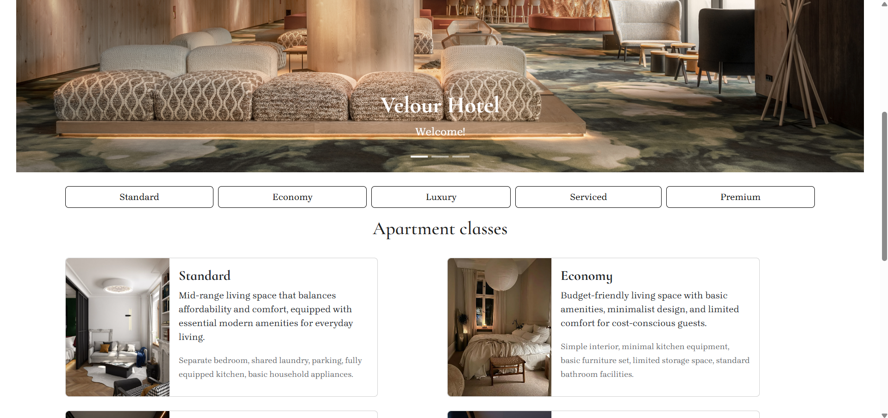
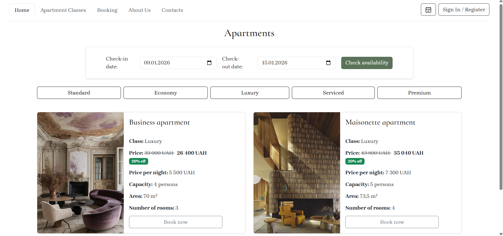
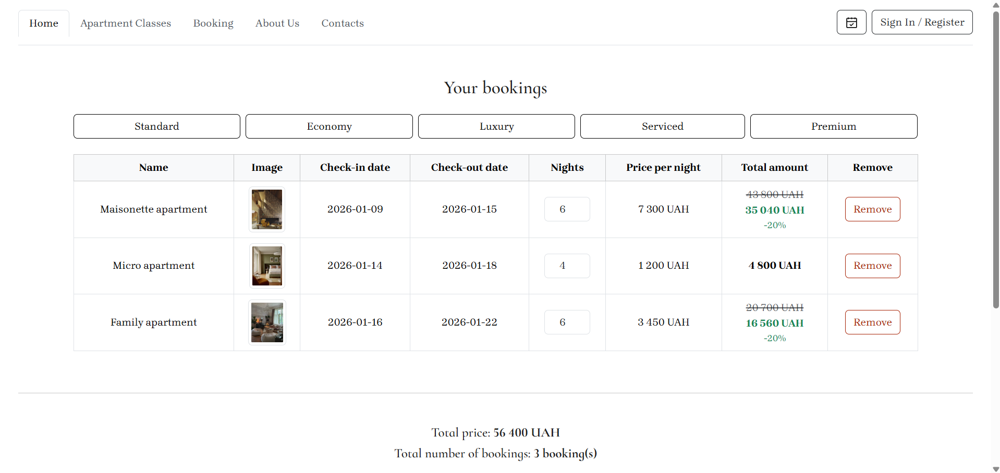

# Hotel Booking App

This repository contains a **Hotel Apartments Booking Application** developed as a course project (end of the Object-Oriented Programming discipline).  
The system is implemented using **Java**, **Spring Boot**, and **MySQL**, with a focus on object-oriented design and modular architecture.

The application allows users to browse apartments, manage bookings, and supports authentication and authorization.

---

## Project Overview

The **Hotel Booking App** is a backend application that enables guests to browse a catalog of apartments, add them to a cart, and complete bookings.

The project demonstrates:

- Object-Oriented Programming principles
- Layered architecture
- Secure authentication and authorization
- Database versioning with migrations
- Application of programming patterns in business logic

---

## Technologies Used

- **Java 22**
- **Spring Boot 3.4** (backend framework with auto-configuration)
- **Spring Security** (authentication & authorization)
- **Spring MVC** (Model–View–Controller architecture)
- **Hibernate / JPA** (ORM & database interaction)
- **FreeMarker** (server-side template engine)
- **Flyway** (database migrations)
- **Lombok** (boilerplate code reduction)
- **MySQL** (relational database)
- **Maven** (build automation and dependency management)

---

## Key Features

### Authentication & Authorization
- User registration and login
- Role-based access control
- Secure password storage and session handling

### User Roles
- **Admin** – full system access
- **Manager** – manages apartments and bookings
- **User** – browses apartments, adds them to cart, makes reservations

### Business Logic
- Use of programming patterns (e.g. Strategy / Decorator)
- Flexible discount and pricing logic
- Clean separation of concerns

## Home Page

## Apartment Catalog (by Class)

## Booking Cart

